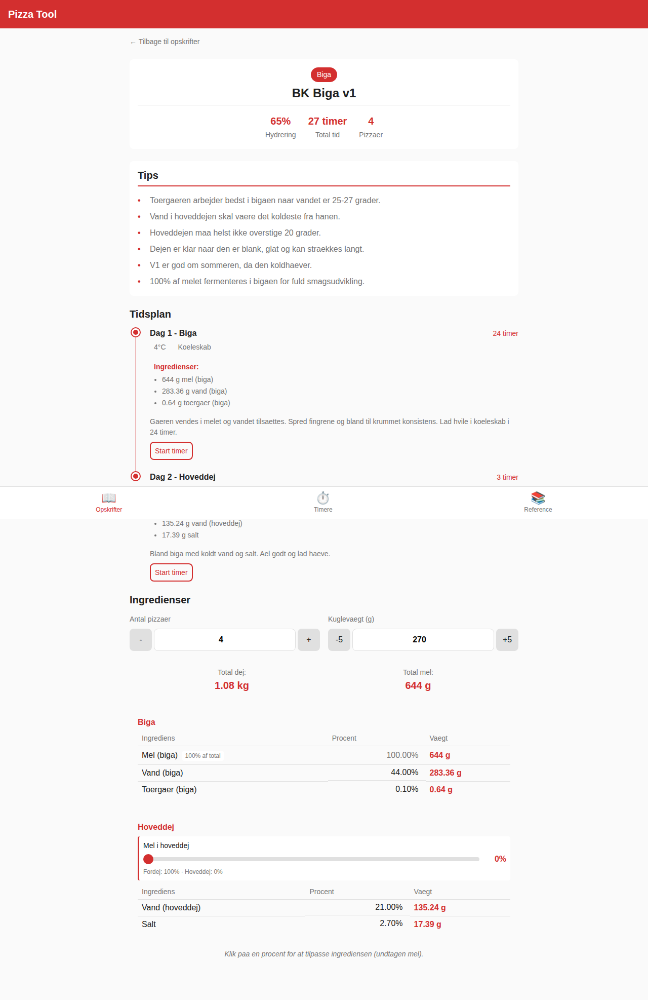
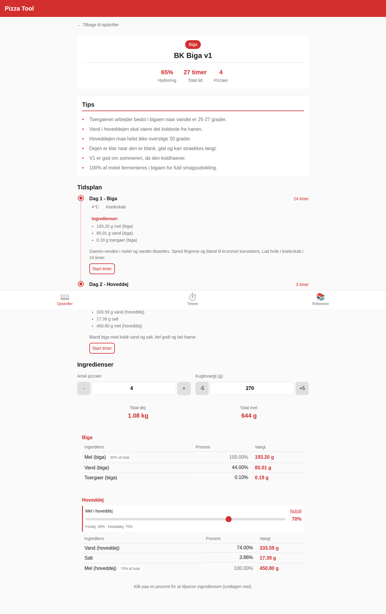

# Predough Split Fix - Before and After

## Problem

When reducing the predough ratio on recipes with 100% predough flour (like BK Biga v1), the main dough flour and water ingredients were not being added to the recipe.

## Solution

This PR fixes the issue by:

1. Adding main flour ingredient when predough ratio decreases below 100%
2. Adjusting main water to maintain total hydration when predough water decreases
3. Adding main water ingredient if the recipe doesn't have one and water needs redistribution

## Visual Demonstration

### Before the Slider Adjustment (100% Predough)

The BK Biga v1 recipe starts with 100% of flour in the biga (predough):

**Key points:**

- All 644g flour is in the Biga section (100% of total)
- Water is split: 283.36g in Biga, 135.24g in Main dough
- No main dough flour exists yet (slider shows "Fordej: 100% - Hoveddej: 0%")

### After Adjusting to 70% Main / 30% Predough

When the slider is moved to 70% (meaning 70% main dough flour, 30% predough flour):

**Key changes:**

- **Biga flour reduced** from 644g to 193.20g (30% of total)
- **Main dough flour ADDED**: 450.80g (70% of total) - _This is the fix!_
- Biga water reduced from 283.36g to 85.01g
- Main dough water increased from 135.24g to 333.59g
- Total hydration maintained at 65%
- Slider now shows "Fordej: 30% - Hoveddej: 70%"

## Technical Details

The fix is in `src/lib/utils/baker-percentage.ts`:

1. **Main flour addition**: When `predoughRatio < 1` and no main flour exists, a new main flour ingredient is added with the correct percentage
2. **Water redistribution**: Water is properly redistributed between predough and main dough to maintain the recipe's total hydration
3. **Main water addition**: If no main water ingredient exists and water needs to be moved from predough, a new main water ingredient is created

This ensures recipes with 100% predough can be smoothly adjusted to any predough/main split ratio.
